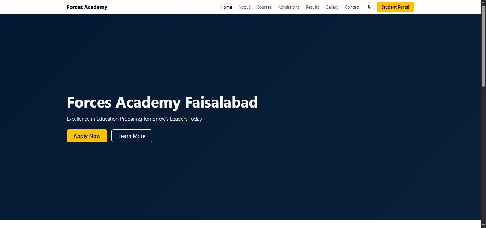
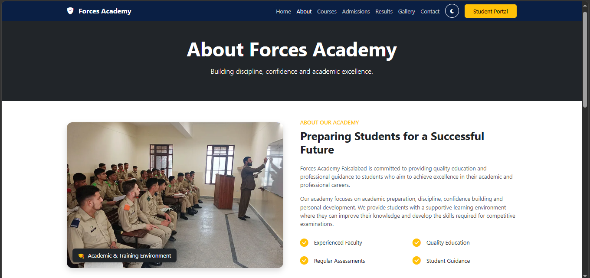
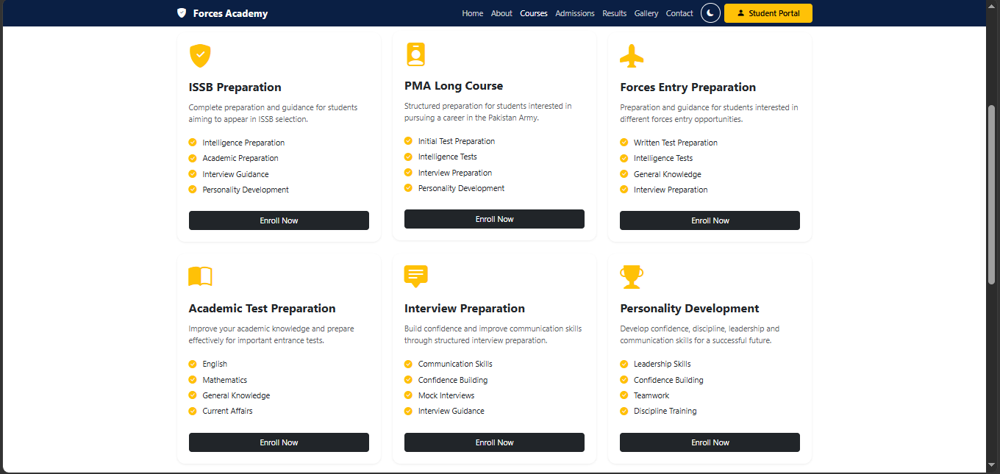
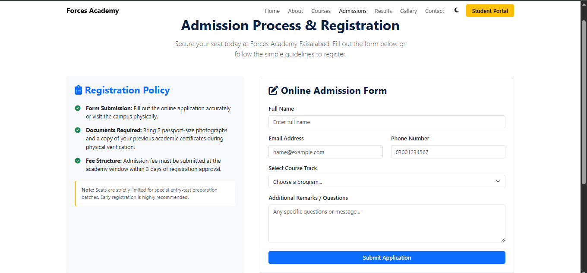
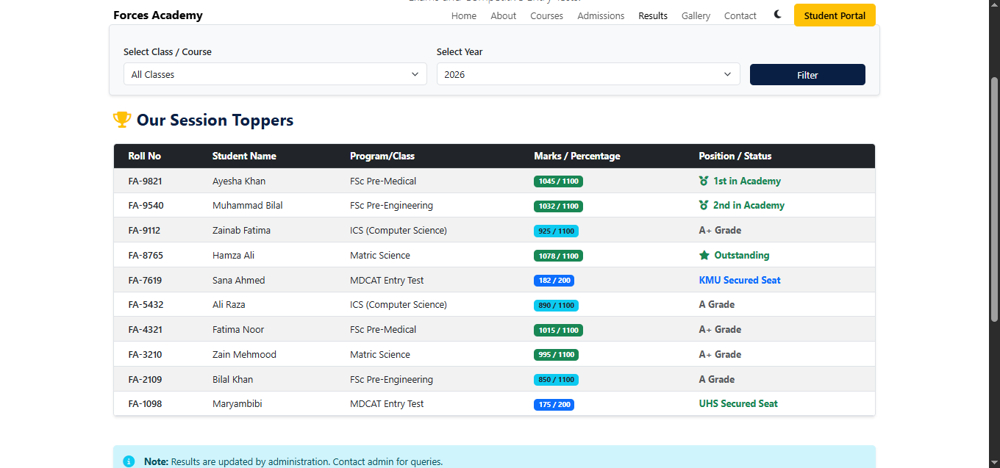

<div align="center">

  <h1>🎓 Forces Academy Faisalabad</h1>
  <p><b>A modern, fully responsive multi-page web application designed for Forces Academy Faisalabad.</b></p>
  <p><i>Developed during the Code Saviours Internship 2026</i></p>

  [](#)
  [](#)
  [](#)
  [](#)

  <br>
  <br>

  🔗 **[Live Website Demo](https://amnamsaeed5-hash.github.io/forces-academy)** • 📁 **[GitHub Repository](https://github.com/amnamsaeed5-hash/forces-academy)**

</div>

---

## 📌 Project Overview

**Forces Academy Faisalabad** web platform ko taayar karne ka maqsad students ko academy ke courses, admission procedures, aur updates ke baare mein seamlessly inform karna hai. Is UI/UX-focused multi-page website ko full responsiveness, interactive features, aur visual appeal ke saath design kiya gaya hai.

---

## ✨ Key Features

* **Multi-Page Navigation:** Complete layout spanning Home, About, Courses, Admissions, Results, Gallery, and Contact pages.
* **Fully Responsive Design:** Mobile-first approach configured using Bootstrap 5 grid layout.
* **Dark & Light Mode Toggle:** Dynamic theme switcher using JavaScript with `localStorage` state persistence.
* **Real-Time Admission Form:** Integrated with EmailJS API for serverless client-side email notifications.
* **Interactive UI Elements:** Dynamic scroll-triggered counter animations and student portal LMS redirection links.

---

## ⚡ Challenges Faced & Solutions

* **Cross-Device Layout Consistency:** High-density grids ko Breakpoints (`col-lg`, `col-md`, `col-sm`) aur Bootstrap 5 Flexbox utilities se handle kiya taake har screen par fluid flow rahe.
* **Form Submission Refresh Issue:** Client-side EmailJS integration ke dauran page refresh hone ko JavaScript event handling (`e.preventDefault()`) se solve kiya aur live user status messages add kiye.

---

## 🛠️ Tech Stack & Tools

* **Frontend:** HTML5, CSS3, JavaScript (ES6+)
* **CSS Framework:** Bootstrap 5
* **Third-Party API:** EmailJS API
* **Version Control & Hosting:** Git, GitHub, GitHub Pages

---

## 🚀 How to Run Locally

1. Repository ko clone karein:
   ```bash
   git clone [https://github.com/amnamsaeed5-hash/forces-academy.git](https://github.com/amnamsaeed5-hash/forces-academy.git)
   ## 📸 Screenshots

### 🏠 Home Page


### ℹ️ About Page


### 📚 Courses Page


### 🎓 Admissions Page


### 📊 Results Page

